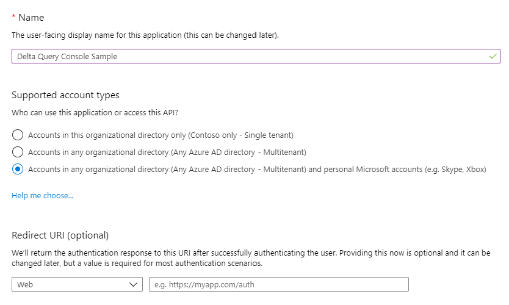
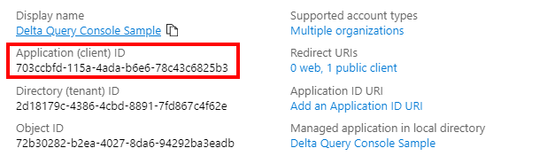

# Microsoft Graph delta query sample

[](https://github.com/microsoftgraph/msgraph-sample-deltaquery/actions/workflows/dotnet.yml) 

This console application demonstrates how to make [delta queries](https://learn.microsoft.com/graph/delta-query-overview) to Microsoft Graph, allowing applications to request only changed entities within a target resource. This sample monitors changes to the mail folders in a user's mailbox.

## How To Run This Sample

To run this sample you will need:

- The [.NET 7.0 SDK](https://dotnet.microsoft.com/download)
- A user in a Microsoft 365 tenant with an Exchange Online mailbox.

### Step 1: Register the sample application in Azure Active Directory

Before running the sample, you will need to create an app registration in Azure Active Directory to obtain a client ID. You can do this with the PowerShell script in this sample, or you can register it manually in the Azure Active Directory portal.

#### Option 1: Register with PowerShell

The [RegisterApp.ps1](RegisterApp.ps1) script uses the [Microsoft Graph PowerShell SDK](https://learn.microsoft.com/microsoftgraph/overview) to create the app registration. You will need to [install the Microsoft Graph PowerShell SDK](https://learn.microsoft.com/powershell/microsoftgraph/installation) to use this script.

> **IMPORTANT**: The PowerShell script requires a work/school account with the **Application administrator**, **Cloud application administrator**, or **Global administrator** role. If your account has the **Application developer** role, you can register in the Azure AD admin center.

1. Open [PowerShell 7](https://learn.microsoft.com/powershell/scripting/install/installing-powershell-on-windows) in the root directory of this sample.

1. Run the following command to set the execution policy for the current PowerShell window to allow the script to run.

    ```powershell
    Set-ExecutionPolicy -ExecutionPolicy RemoteSigned -Scope Process
    ```

1. Run the script with the following command.

    ```powershell
    ./RegisterApp.ps1 -AppName "Delta Query Console Sample"
    ```

1. Follow the prompt to open `https://microsoft.com/devicelogin` in a browser, enter the provided code, and complete the authentication process.

1. The application ID is printed to the console.

    ```powershell
    SUCCESS
    Client ID: 2fb1652f-a9a0-4db9-b220-b224b8d9d38b
    Tenant ID: common
    ```

#### Option 2: Register with the Azure Active Directory admin center

1. Open a browser and navigate to the [Azure Active Directory admin center](https://aad.portal.azure.com) and login using a Microsoft 365 user that has permission to register an application in Azure Active Directory.

1. Select **Azure Active Directory** in the left-hand navigation, then select **App registrations** under **Manage**.

    

1. Select **New registration**. On the **Register an application** page, set the values as follows.

    - Set **Name** to `Delta Query Console Sample`.
    - Set **Supported account types** to **Accounts in any organizational directory and personal Microsoft accounts**.
    - Leave **Redirect URI** empty.

    

1. Select **Register**. On the **Delta Query Console Sample** page, copy the value of the **Application (client) ID** and save it, you will need it in the next step.

    

1. Select **Authentication** under **Manage**. Locate the **Advanced settings** section and change the **Allow public client flows** toggle to **Yes**, then choose **Save**.

    

### Step 2: Configure the sample

Open [appsettings.json](src/appsettings.json) and replace `YOUR_CLIENT_ID_HERE` with the client ID of your app registration. Update other settings as needed.

| Setting | Description |
|---------|-------------|
| `clientId` | The client ID of your app registration |
| `tenantId` | If you registered your application as a [single tenant app](https://learn.microsoft.com/azure/active-directory/develop/single-and-multi-tenant-apps), add your Azure tenant ID here. Otherwise, leave as `common`. |
| `graphUserScopes` | The Microsoft Graph permission scopes needed by the app. |
| `pollInterval` | The number of seconds to wait between poll requests |
| `authRecordCachePath` | Path to a file to cache the [authentication record](#authentication-record-cache). Set to empty string to disable authentication caching. |

### Step 3: Run the sample

When the sample runs, it will prompt you to browse to a login URL and enter a device code. Once signed in, the app will check for changes to the mail folders in the user's mailbox every 30 seconds.

#### Option 1: Using Visual Studio Code

1. Open the root folder of this sample using Visual Studio Code.

1. On the **Debug** menu, choose **Start Debugging**.

#### Option 2: From the command line

1. Open your command-line interface (CLI) in the directory that contains **DeltaQuery.csproj**.

1. Run the following command to build the sample.

    ```Shell
    dotnet build
    ```

1. Run the following command to run the sample.

    ```Shell
    dotnet run
    ```

### Authentication record cache

The first time you run this sample, it will prompt you to authenticate in your browser. Your authentication record will be persisted to disk so that if you run the sample again, the app will silently authenticate. You can make the app reauthenticate by deleting the authentication cache file before running the sample.

To disable authentication caching, set the `authRecordCachePath` value in appsettings.json to an empty string.

## Code of conduct

This project has adopted the [Microsoft Open Source Code of Conduct](https://opensource.microsoft.com/codeofconduct/). For more information see the [Code of Conduct FAQ](https://opensource.microsoft.com/codeofconduct/faq/) or contact [opencode@microsoft.com](mailto:opencode@microsoft.com) with any additional questions or comments.

## Disclaimer

**THIS CODE IS PROVIDED _AS IS_ WITHOUT WARRANTY OF ANY KIND, EITHER EXPRESS OR IMPLIED, INCLUDING ANY IMPLIED WARRANTIES OF FITNESS FOR A PARTICULAR PURPOSE, MERCHANTABILITY, OR NON-INFRINGEMENT.**
